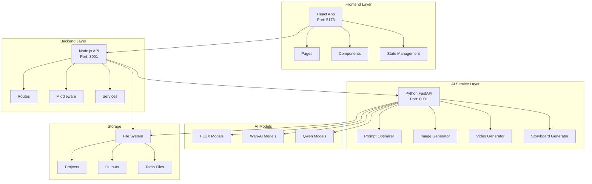

# EasyVideo - AI-Powered Video Creation Platform

> **[中文文档](README_zh-CN.md) | English**

A comprehensive AI-powered video creation platform that transforms text into images and images into videos using state-of-the-art AI models including FLUX and Wan-AI.

[](https://github.com/username/EasyVideo/stargazers)
[](LICENSE)
[](https://nodejs.org/)
[](https://python.org/)
[](https://reactjs.org/)
[](https://typescriptlang.org/)

## 🎯 Key Features

- **🎨 Text-to-Image Generation**: High-quality image generation using FLUX models
- **🎬 Image-to-Video Conversion**: Transform static images into dynamic videos with Wan-AI models
- **📝 AI Storyboard Creation**: Automated storyboard and script generation
- **📁 Project Management**: Complete project lifecycle management with export capabilities
- **⚡ Real-time Preview**: Live preview during generation process
- **🔧 Multi-format Support**: Support for various image and video formats

## 📋 Table of Contents

- [Quick Start](#-quick-start)
- [Architecture Overview](#-architecture-overview)
- [Project Structure](#-project-structure)
- [Feature Mapping](#-feature-mapping)
- [Technical Documentation](#-technical-documentation)
- [Configuration](#-configuration)
- [Development](#-development)
- [Deployment](#-deployment)
- [FAQ](#-faq)
- [Contributing](#-contributing)
- [License](#-license)

## 🚀 Quick Start

### Prerequisites

- **Node.js** 12.22.9+ (optimized for this version)
- **Python** 3.7+
- **npm** 6+
- **4GB+ RAM**
- **10GB+ available disk space**
- **NVIDIA GPU** with 8GB+ VRAM (recommended for AI acceleration)

### One-Click Setup

```bash
# Clone the repository
git clone <repository-url>
cd EasyVideo

# One-click startup (installs dependencies and starts all services)
./start.sh
```

### Access the Application

- **Frontend**: http://localhost:5173
- **Backend API**: http://localhost:3001
- **AI Service**: http://localhost:8001

### Quick Demo

1. **Text-to-Image**: Enter "A beautiful sunset over mountains" → Generate high-quality image
2. **Image-to-Video**: Upload the generated image → Create 4-second video
3. **Project Export**: Save and export your creation

## 🏗️ Architecture Overview



## 📁 Project Structure

```
EasyVideo/
├── frontend/                 # React frontend application
│   ├── src/
│   │   ├── components/      # Reusable UI components
│   │   ├── pages/          # Application pages
│   │   ├── hooks/          # Custom React hooks
│   │   ├── services/       # API service layer
│   │   ├── store/          # State management (Zustand)
│   │   └── utils/          # Utility functions
│   ├── package.json        # Frontend dependencies
│   └── vite.config.ts      # Vite configuration
├── backend/                 # Node.js backend service
│   ├── src/
│   │   ├── routes/         # API route definitions
│   │   ├── controllers/    # Request handlers
│   │   ├── middleware/     # Express middleware
│   │   ├── services/       # Business logic
│   │   └── utils/          # Backend utilities
│   ├── package.json        # Backend dependencies
│   └── tsconfig.json       # TypeScript configuration
├── ai-service/             # Python AI service
│   ├── modules/            # AI processing modules
│   │   ├── image_generator.py    # FLUX image generation
│   │   ├── video_generator.py    # Wan-AI video generation
│   │   ├── prompt_optimizer.py   # Prompt optimization
│   │   └── storyboard_generator.py # Storyboard creation
│   ├── api_server.py       # FastAPI server
│   └── requirements.txt    # Python dependencies
├── config/                 # Configuration files
│   ├── config.json         # Main configuration
│   └── default.json        # Default settings
├── outputs/                # Generated content
│   ├── images/            # Generated images
│   └── videos/            # Generated videos
├── projects/              # User projects
├── scripts/               # Utility scripts
├── start.sh              # One-click startup script
├── stop.sh               # Service stop script
└── .env.example          # Environment variables template
```

## 🎯 Feature Mapping

| Feature | Entry Point | Core Module | Configuration |
|---------|-------------|-------------|---------------|
| **Text-to-Image** | [`frontend/src/pages/TextToImagePage.tsx`](frontend/src/pages/TextToImagePage.tsx) | [`ai-service/modules/image_generator.py`](ai-service/modules/image_generator.py) | [`config/config.json`](config/config.json) |
| **Image-to-Video** | [`frontend/src/pages/ImageToVideoPage.tsx`](frontend/src/pages/ImageToVideoPage.tsx) | [`ai-service/modules/video_generator.py`](ai-service/modules/video_generator.py) | [`config/config.json`](config/config.json) |
| **Storyboard Generation** | [`frontend/src/pages/StoryboardPage.tsx`](frontend/src/pages/StoryboardPage.tsx) | [`ai-service/modules/storyboard_generator.py`](ai-service/modules/storyboard_generator.py) | [`config/config.json`](config/config.json) |
| **Project Management** | [`frontend/src/pages/ProjectPage.tsx`](frontend/src/pages/ProjectPage.tsx) | [`backend/src/routes/projects.ts`](backend/src/routes/projects.ts) | [`backend/src/services/`](backend/src/services/) |
| **Prompt Optimization** | API Integration | [`ai-service/modules/prompt_optimizer.py`](ai-service/modules/prompt_optimizer.py) | [`config/config.json`](config/config.json) |

## 📚 Technical Documentation

### Module Documentation

For detailed technical documentation of each module, please refer to:

- **[AI Service](ai-service/README.md)** - Python-based AI processing service with FLUX and Wan-AI models
- **[Backend](backend/README.md)** - Node.js API server and middleware layer
- **[Frontend](frontend/README.md)** - React-based web application interface
- **[Configuration](config/README.md)** - System configuration and model management

<details>
<summary><strong>Frontend Architecture</strong></summary>

### Technology Stack
- **Framework**: React 17.0.2 with TypeScript
- **Build Tool**: Vite 2.9.18
- **Styling**: Tailwind CSS 3.1.8
- **State Management**: Zustand 4.1.5
- **Routing**: React Router DOM 6.3.0
- **HTTP Client**: Axios 0.27.2
- **UI Components**: Lucide React, Framer Motion

### Key Features
- Component-based architecture
- TypeScript for type safety
- Responsive design with Tailwind CSS
- Real-time progress tracking
- Error boundary implementation
- Hot module replacement for development

### Development Commands
```bash
cd frontend
npm run dev     # Start development server
npm run build   # Build for production
npm run preview # Preview production build
```

</details>

<details>
<summary><strong>Backend Services</strong></summary>

### Technology Stack
- **Runtime**: Node.js with Express.js 4.17.1
- **Language**: TypeScript 4.3.5
- **File Upload**: Multer 1.4.2
- **CORS**: Enabled for cross-origin requests
- **Static Files**: Served from outputs and projects directories

### API Endpoints
- `GET /api/system/status` - System health check
- `POST /api/generation/text-to-image` - Text-to-image generation
- `POST /api/generation/image-to-video` - Image-to-video conversion
- `GET /api/projects` - List user projects
- `POST /api/projects` - Create new project

### Development Commands
```bash
cd backend
npm run dev     # Start development server
npm run build   # Compile TypeScript
npm start       # Start production server
```

</details>

<details>
<summary><strong>AI Models & Processing</strong></summary>

### Supported Models
- **FLUX.1-Krea-dev**: High-quality image generation
- **FLUX.1-Kontext-dev**: Image editing and enhancement
- **Wan2.2-I2V-A14B**: Image-to-video conversion
- **Qwen2.5-VL-3B-Instruct**: Prompt optimization

### Model Configuration
Models are configured in [`config/config.json`](config/config.json):
```json
{
  "models": {
    "flux": {
      "path": "/path/to/flux/model",
      "enabled": true,
      "description": "Image generation model"
    }
  }
}
```

### Performance Optimization
- Lazy model loading to reduce memory usage
- GPU memory management with configurable limits
- Automatic model unloading after generation
- Batch processing support

</details>

<details>
<summary><strong>Configuration & Environment</strong></summary>

### Environment Setup
1. Copy environment template:
   ```bash
   cp .env.example .env
   ```

2. Configure essential variables:
   ```bash
   BACKEND_PORT=3001
   AI_SERVICE_PORT=8001
   FRONTEND_PORT=5173
   CUDA_VISIBLE_DEVICES=0
   ```

### System Configuration
Main configuration in [`config/config.json`](config/config.json):
- Model paths and settings
- GPU memory limits
- Generation parameters
- Output directories

</details>

## ⚙️ Configuration

### Model Setup

1. **Download AI Models** (optional for full functionality):
   - FLUX models for image generation
   - Wan-AI models for video generation
   - Qwen models for prompt optimization

2. **Update Configuration**:
   Edit [`config/config.json`](config/config.json) with your model paths:
   ```json
   {
     "models": {
       "flux": {
         "path": "/path/to/your/flux/model",
         "enabled": true
       }
     }
   }
   ```

### Environment Variables

Copy [`.env.example`](.env.example) to `.env` and configure:

```bash
# Service Ports
BACKEND_PORT=3001
AI_SERVICE_PORT=8001
FRONTEND_PORT=5173

# GPU Configuration
CUDA_VISIBLE_DEVICES=0

# Storage Paths
OUTPUT_DIR=./outputs
PROJECT_DIR=./projects
```

## 🛠️ Development

### Manual Installation

If you prefer manual setup over the one-click script:

```bash
# Install frontend dependencies
cd frontend
npm install --legacy-peer-deps

# Install backend dependencies
cd ../backend
npm install

# Install AI service dependencies
cd ../ai-service
pip install -r requirements.txt
```

### Development Mode

Start each service in development mode:

```bash
# Terminal 1: Frontend
cd frontend && npm run dev

# Terminal 2: Backend
cd backend && npm run dev

# Terminal 3: AI Service
cd ai-service && python api_server.py
```

### Testing

```bash
# Test AI functions
python test_functions.py

# Test video generation
python test_video_generation.py
```

## 🚀 Deployment

### Production Build

```bash
# Build frontend
cd frontend && npm run build

# Build backend
cd backend && npm run build

# Start production services
./start.sh
```

### Docker Deployment (Coming Soon)

```bash
# Build and run with Docker Compose
docker-compose up -d
```

## ❓ FAQ

<details>
<summary><strong>Installation Issues</strong></summary>

**Q: Dependencies installation fails**
```bash
# Clear cache and reinstall
npm cache clean --force
rm -rf node_modules package-lock.json
npm install --legacy-peer-deps
```

**Q: Port already in use**
```bash
# Check port usage
lsof -i :3001
lsof -i :5173
lsof -i :8001

# Stop all services
./stop.sh
```

</details>

<details>
<summary><strong>Performance Issues</strong></summary>

**Q: GPU out of memory**
- Reduce batch size in configuration
- Lower GPU memory limit in [`config/config.json`](config/config.json)
- Use smaller models or enable model quantization

**Q: Slow generation speed**
- Verify GPU drivers and CUDA installation
- Check model precision settings
- Increase system RAM

</details>

<details>
<summary><strong>Model Issues</strong></summary>

**Q: Models not loading**
- Verify model paths in [`config/config.json`](config/config.json)
- Check model file permissions
- Ensure sufficient disk space

**Q: Generation quality issues**
- Adjust generation parameters
- Try prompt optimization
- Verify model versions

</details>

## 🤝 Contributing

We welcome contributions! Please see our [Contributing Guidelines](CONTRIBUTING.md) for details.

### Development Workflow

1. Fork the repository
2. Create a feature branch: `git checkout -b feature/amazing-feature`
3. Make your changes and test thoroughly
4. Commit with conventional commits: `git commit -m 'feat: add amazing feature'`
5. Push to your branch: `git push origin feature/amazing-feature`
6. Open a Pull Request

### Code Standards

- **Frontend**: ESLint + Prettier for TypeScript/React
- **Backend**: TypeScript strict mode
- **AI Service**: PEP 8 for Python
- **Commits**: Conventional Commits specification

## 📄 License

This project is licensed under the MIT License - see the [LICENSE](LICENSE) file for details.

## 🙏 Acknowledgments

- **[React](https://reactjs.org/)** - Frontend framework
- **[Express.js](https://expressjs.com/)** - Backend framework
- **[FastAPI](https://fastapi.tiangolo.com/)** - AI service framework
- **[Tailwind CSS](https://tailwindcss.com/)** - CSS framework
- **[Vite](https://vitejs.dev/)** - Build tool
- **FLUX Models** - Image generation capabilities
- **Wan-AI Models** - Video generation capabilities

---

**EasyVideo** - Transforming ideas into visual stories with AI! 🎬✨

For support, please [open an issue](../../issues) or contact the development team.