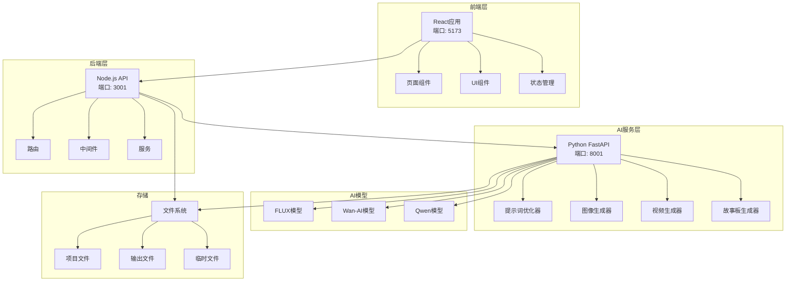

# EasyVideo - AI视频制作平台

> **[English](README.md) | 中文文档**

一个全面的AI驱动视频创作平台，使用最先进的AI模型（包括FLUX和Wan-AI）将文本转换为图像，将图像转换为视频。

[](https://github.com/username/EasyVideo/stargazers)
[](LICENSE)
[](https://nodejs.org/)
[](https://python.org/)
[](https://reactjs.org/)
[](https://typescriptlang.org/)

## 🎯 核心功能

- **🎨 文本生成图像**: 使用FLUX模型生成高质量图像
- **🎬 图像转视频**: 使用Wan-AI模型将静态图像转换为动态视频
- **📝 AI故事板创作**: 自动化故事板和脚本生成
- **📁 项目管理**: 完整的项目生命周期管理和导出功能
- **⚡ 实时预览**: 生成过程中的实时预览
- **🔧 多格式支持**: 支持各种图像和视频格式

## 📋 目录

- [快速开始](#-快速开始)
- [架构概览](#-架构概览)
- [项目结构](#-项目结构)
- [功能映射](#-功能映射)
- [技术文档](#-技术文档)
- [配置说明](#-配置说明)
- [开发指南](#-开发指南)
- [部署说明](#-部署说明)
- [常见问题](#-常见问题)
- [贡献指南](#-贡献指南)
- [许可证](#-许可证)

## 🚀 快速开始

### 环境要求

- **Node.js** 12.22.9+ (针对此版本优化)
- **Python** 3.7+
- **npm** 6+
- **内存** 4GB+
- **磁盘空间** 10GB+
- **NVIDIA GPU** 8GB+ 显存 (推荐用于AI加速)

### 一键启动

```bash
# 克隆仓库
git clone <repository-url>
cd EasyVideo

# 一键启动（自动安装依赖并启动所有服务）
./start.sh
```

### 访问应用

- **前端界面**: http://localhost:5173
- **后端API**: http://localhost:3001
- **AI服务**: http://localhost:8001

### 快速演示

1. **文本生成图像**: 输入"美丽的山间日落"→ 生成高质量图像
2. **图像转视频**: 上传生成的图像 → 创建4秒视频
3. **项目导出**: 保存并导出您的创作

## 🏗️ 架构概览



## 📁 项目结构

```
EasyVideo/
├── frontend/                 # React前端应用
│   ├── src/
│   │   ├── components/      # 可复用UI组件
│   │   ├── pages/          # 应用页面
│   │   ├── hooks/          # 自定义React钩子
│   │   ├── services/       # API服务层
│   │   ├── store/          # 状态管理 (Zustand)
│   │   └── utils/          # 工具函数
│   ├── package.json        # 前端依赖
│   └── vite.config.ts      # Vite配置
├── backend/                 # Node.js后端服务
│   ├── src/
│   │   ├── routes/         # API路由定义
│   │   ├── controllers/    # 请求处理器
│   │   ├── middleware/     # Express中间件
│   │   ├── services/       # 业务逻辑
│   │   └── utils/          # 后端工具
│   ├── package.json        # 后端依赖
│   └── tsconfig.json       # TypeScript配置
├── ai-service/             # Python AI服务
│   ├── modules/            # AI处理模块
│   │   ├── image_generator.py    # FLUX图像生成
│   │   ├── video_generator.py    # Wan-AI视频生成
│   │   ├── prompt_optimizer.py   # 提示词优化
│   │   └── storyboard_generator.py # 故事板创建
│   ├── api_server.py       # FastAPI服务器
│   └── requirements.txt    # Python依赖
├── config/                 # 配置文件
│   ├── config.json         # 主配置文件
│   └── default.json        # 默认设置
├── outputs/                # 生成内容
│   ├── images/            # 生成的图像
│   └── videos/            # 生成的视频
├── projects/              # 用户项目
├── scripts/               # 工具脚本
├── start.sh              # 一键启动脚本
├── stop.sh               # 服务停止脚本
└── .env.example          # 环境变量模板
```

## 🎯 功能映射

| 功能 | 入口点 | 核心模块 | 配置文件 |
|------|--------|----------|----------|
| **文本生成图像** | [`frontend/src/pages/TextToImagePage.tsx`](frontend/src/pages/TextToImagePage.tsx) | [`ai-service/modules/image_generator.py`](ai-service/modules/image_generator.py) | [`config/config.json`](config/config.json) |
| **图像转视频** | [`frontend/src/pages/ImageToVideoPage.tsx`](frontend/src/pages/ImageToVideoPage.tsx) | [`ai-service/modules/video_generator.py`](ai-service/modules/video_generator.py) | [`config/config.json`](config/config.json) |
| **故事板生成** | [`frontend/src/pages/StoryboardPage.tsx`](frontend/src/pages/StoryboardPage.tsx) | [`ai-service/modules/storyboard_generator.py`](ai-service/modules/storyboard_generator.py) | [`config/config.json`](config/config.json) |
| **项目管理** | [`frontend/src/pages/ProjectPage.tsx`](frontend/src/pages/ProjectPage.tsx) | [`backend/src/routes/projects.ts`](backend/src/routes/projects.ts) | [`backend/src/services/`](backend/src/services/) |
| **提示词优化** | API集成 | [`ai-service/modules/prompt_optimizer.py`](ai-service/modules/prompt_optimizer.py) | [`config/config.json`](config/config.json) |

## 📚 技术文档

### 模块文档

详细的技术文档请参考各模块的README文件：

- **[AI服务](ai-service/README.md)** - 基于Python的AI处理服务，包含FLUX和Wan-AI模型
- **[后端服务](backend/README.md)** - Node.js API服务器和中间件层
- **[前端应用](frontend/README.md)** - 基于React的Web应用界面
- **[配置管理](config/README.md)** - 系统配置和模型管理

<details>
<summary><strong>前端架构</strong></summary>

### 技术栈
- **框架**: React 17.0.2 + TypeScript
- **构建工具**: Vite 2.9.18
- **样式**: Tailwind CSS 3.1.8
- **状态管理**: Zustand 4.1.5
- **路由**: React Router DOM 6.3.0
- **HTTP客户端**: Axios 0.27.2
- **UI组件**: Lucide React, Framer Motion

### 核心特性
- 组件化架构设计
- TypeScript类型安全
- Tailwind CSS响应式设计
- 实时进度跟踪
- 错误边界实现
- 开发环境热模块替换

### 开发命令
```bash
cd frontend
npm run dev     # 启动开发服务器
npm run build   # 生产环境构建
npm run preview # 预览生产构建
```

</details>

<details>
<summary><strong>后端服务</strong></summary>

### 技术栈
- **运行时**: Node.js + Express.js 4.17.1
- **语言**: TypeScript 4.3.5
- **文件上传**: Multer 1.4.2
- **跨域**: 启用CORS支持
- **静态文件**: 从outputs和projects目录提供服务

### API端点
- `GET /api/system/status` - 系统健康检查
- `POST /api/generation/text-to-image` - 文本生成图像
- `POST /api/generation/image-to-video` - 图像转视频
- `GET /api/projects` - 列出用户项目
- `POST /api/projects` - 创建新项目

### 开发命令
```bash
cd backend
npm run dev     # 启动开发服务器
npm run build   # 编译TypeScript
npm start       # 启动生产服务器
```

</details>

<details>
<summary><strong>AI模型与处理</strong></summary>

### 支持的模型
- **FLUX.1-Krea-dev**: 高质量图像生成
- **FLUX.1-Kontext-dev**: 图像编辑和增强
- **Wan2.2-I2V-A14B**: 图像转视频
- **Qwen2.5-VL-3B-Instruct**: 提示词优化

### 模型配置
模型在[`config/config.json`](config/config.json)中配置：
```json
{
  "models": {
    "flux": {
      "path": "/path/to/flux/model",
      "enabled": true,
      "description": "图像生成模型"
    }
  }
}
```

### 性能优化
- 懒加载模型以减少内存使用
- 可配置的GPU内存管理
- 生成后自动卸载模型
- 批处理支持

</details>

<details>
<summary><strong>配置与环境</strong></summary>

### 环境设置
1. 复制环境模板：
   ```bash
   cp .env.example .env
   ```

2. 配置必要变量：
   ```bash
   BACKEND_PORT=3001
   AI_SERVICE_PORT=8001
   FRONTEND_PORT=5173
   CUDA_VISIBLE_DEVICES=0
   ```

### 系统配置
主配置文件[`config/config.json`](config/config.json)：
- 模型路径和设置
- GPU内存限制
- 生成参数
- 输出目录

</details>

## ⚙️ 配置说明

### 模型设置

1. **下载AI模型**（完整功能可选）：
   - FLUX模型用于图像生成
   - Wan-AI模型用于视频生成
   - Qwen模型用于提示词优化

2. **更新配置**：
   编辑[`config/config.json`](config/config.json)设置模型路径：
   ```json
   {
     "models": {
       "flux": {
         "path": "/path/to/your/flux/model",
         "enabled": true
       }
     }
   }
   ```

### 环境变量

复制[`.env.example`](.env.example)到`.env`并配置：

```bash
# 服务端口
BACKEND_PORT=3001
AI_SERVICE_PORT=8001
FRONTEND_PORT=5173

# GPU配置
CUDA_VISIBLE_DEVICES=0

# 存储路径
OUTPUT_DIR=./outputs
PROJECT_DIR=./projects
```

## 🛠️ 开发指南

### 手动安装

如果您更喜欢手动设置而不是一键脚本：

```bash
# 安装前端依赖
cd frontend
npm install --legacy-peer-deps

# 安装后端依赖
cd ../backend
npm install

# 安装AI服务依赖
cd ../ai-service
pip install -r requirements.txt
```

### 开发模式

分别启动各个服务的开发模式：

```bash
# 终端1: 前端
cd frontend && npm run dev

# 终端2: 后端
cd backend && npm run dev

# 终端3: AI服务
cd ai-service && python api_server.py
```

### 测试

```bash
# 测试AI功能
python test_functions.py

# 测试视频生成
python test_video_generation.py
```

## 🚀 部署说明

### 生产构建

```bash
# 构建前端
cd frontend && npm run build

# 构建后端
cd backend && npm run build

# 启动生产服务
./start.sh
```

### Docker部署（即将推出）

```bash
# 使用Docker Compose构建和运行
docker-compose up -d
```

## ❓ 常见问题

<details>
<summary><strong>安装问题</strong></summary>

**问：依赖安装失败**
```bash
# 清除缓存并重新安装
npm cache clean --force
rm -rf node_modules package-lock.json
npm install --legacy-peer-deps
```

**问：端口已被占用**
```bash
# 检查端口使用情况
lsof -i :3001
lsof -i :5173
lsof -i :8001

# 停止所有服务
./stop.sh
```

</details>

<details>
<summary><strong>性能问题</strong></summary>

**问：GPU内存不足**
- 在配置中减少批处理大小
- 在[`config/config.json`](config/config.json)中降低GPU内存限制
- 使用更小的模型或启用模型量化

**问：生成速度慢**
- 验证GPU驱动和CUDA安装
- 检查模型精度设置
- 增加系统内存

</details>

<details>
<summary><strong>模型问题</strong></summary>

**问：模型加载失败**
- 验证[`config/config.json`](config/config.json)中的模型路径
- 检查模型文件权限
- 确保有足够的磁盘空间

**问：生成质量问题**
- 调整生成参数
- 尝试提示词优化
- 验证模型版本

</details>

## 🤝 贡献指南

我们欢迎贡献！请查看我们的[贡献指南](CONTRIBUTING.md)了解详情。

### 开发工作流

1. Fork仓库
2. 创建功能分支：`git checkout -b feature/amazing-feature`
3. 进行更改并彻底测试
4. 使用约定式提交：`git commit -m 'feat: add amazing feature'`
5. 推送到您的分支：`git push origin feature/amazing-feature`
6. 开启Pull Request

### 代码标准

- **前端**: ESLint + Prettier for TypeScript/React
- **后端**: TypeScript严格模式
- **AI服务**: Python PEP 8
- **提交**: 约定式提交规范

## 📄 许可证

本项目采用MIT许可证 - 查看[LICENSE](LICENSE)文件了解详情。

## 🙏 致谢

- **[React](https://reactjs.org/)** - 前端框架
- **[Express.js](https://expressjs.com/)** - 后端框架
- **[FastAPI](https://fastapi.tiangolo.com/)** - AI服务框架
- **[Tailwind CSS](https://tailwindcss.com/)** - CSS框架
- **[Vite](https://vitejs.dev/)** - 构建工具
- **FLUX模型** - 图像生成能力
- **Wan-AI模型** - 视频生成能力

---

**EasyVideo** - 用AI将创意转化为视觉故事！🎬✨

如需支持，请[提交issue](../../issues)或联系开发团队。